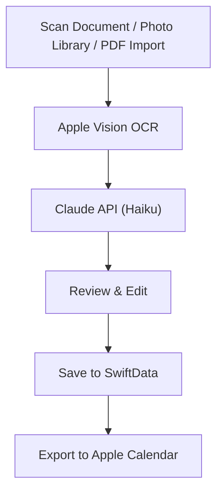

# Sylly - AI Syllabus Scanner

*Scan. Extract. Never miss a deadline.*

[](https://swift.org)
[](https://developer.apple.com/ios/)
[](https://developer.apple.com/xcode/swiftui/)
[](https://anthropic.com)
<!-- Uncomment once approved: -->
<!-- [](YOUR_APP_STORE_LINK) -->

Sylly is an iOS app built for college and high school students who are tired of manually copying due dates from their syllabi. Scan a syllabus with your camera, import photos, or upload a PDF — Sylly uses OCR and AI to extract every assignment and due date, then lets you review everything before saving it to the app and exporting to Apple Calendar.

## Screenshots

<!-- Add your iPhone screenshots here (use 3-4 for best layout): -->
<!-- <p align="center"> -->
<!--    -->
<!--    -->
<!--    -->
<!--    -->
<!-- </p> -->

## Features

- [x] Multi-page document scanning with the built-in camera
- [x] Photo library multi-select for existing syllabus images
- [x] PDF import from the Files app
- [x] OCR text extraction using Apple Vision Framework
- [x] AI-powered syllabus parsing with Claude API (Haiku)
- [x] Review and edit parsed courses and assignments before saving
- [x] Calendar export with EventKit (all-day events + reminders)
- [x] Course management with upcoming and completed sections
- [x] Schedule view with a 5-day week strip
- [x] Manually add assignments to existing courses
- [x] Edit and delete courses and assignments
- [x] Dark mode support
- [ ] Push notifications for upcoming due dates (v1.1)

## How It Works



1. **Scan** — Use the document scanner camera, select photos from your library, or import a PDF from the Files app. Multi-page documents are fully supported.
2. **Extract** — Apple Vision Framework runs OCR on each page to extract the raw text from your syllabus.
3. **Parse** — The extracted text is sent to Claude API (Haiku), which intelligently identifies the course name, course code, and all assignments with their titles, due dates, and types (exam, quiz, homework, project).
4. **Review** — You get a full review screen where you can edit the course name, icon, color, and every assignment detail before saving.
5. **Save** — Everything is saved locally to your device using SwiftData with full offline access.
6. **Export** — One tap exports all assignments to Apple Calendar as all-day events with a 1-day-before reminder. Duplicate prevention is built in.

## Tech Stack

| Layer | Technology |
|-------|------------|
| UI Framework | SwiftUI |
| Language | Swift 6 |
| Minimum iOS | iOS 17.0 |
| Data Persistence | SwiftData |
| OCR | Apple Vision Framework |
| AI Processing | Claude API (Haiku) |
| Calendar | EventKit |
| Architecture | MVVM |

## Getting Started

> **Note:** This app requires a Claude API key from [Anthropic](https://www.anthropic.com) to run locally.

### Requirements

- Xcode 16.0+
- iOS 17.0+
- iPhone only
- Claude API key

### Setup

1. Clone the repository
   ```bash
   git clone https://github.com/imAryanL/sylly-ios-app.git
   ```
2. Create a `Secrets.xcconfig` file in the project root
   ```
   CLAUDE_API_KEY = your-api-key-here
   ```
3. Open `Sylly.xcodeproj` in Xcode
4. Build and run on a simulator or device

## Privacy Policy

[Privacy Policy](https://imaryanl.github.io/sylly-privacy)

## Contact

Built by **Aryan Lakhani**

[](https://linkedin.com/in/aryan-lakhani/)
[](https://github.com/imAryanL)
